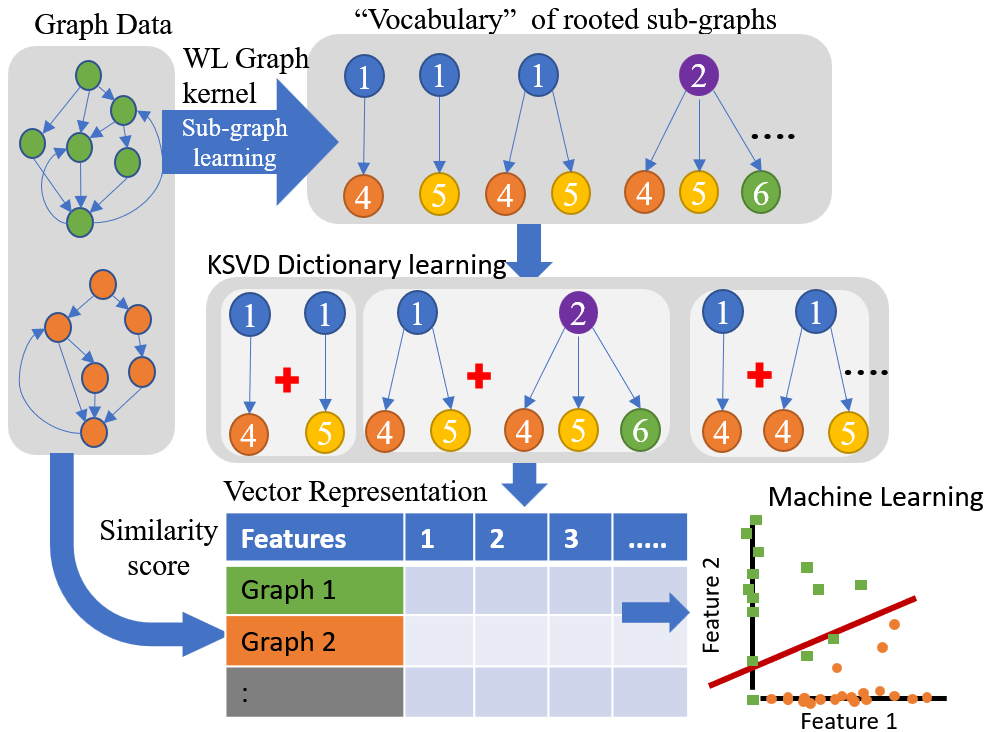

# Dictionary Learning on Graph Data with Weisfeiler-Lehman Sub-Tree Kernel and KSVD

!!!!! Under construction !!!!!!!!

Whole graph embedding method using WL sub-tree kernel and KSVD sparse representation. This method is based on the Graph2Vec method implemented by KarateClub package.

# WL+KSVD
An implementation of “WL+KSVD” from the ICASSP 2023 paper “Dictionary Learning on Graph Data with Weisfieler-Lehman
Sub-Tree Kernel and Ksvd”. The procedure creates Weisfeiler-Lehman tree features for nodes in graphs". 
The procedure creates Weisfeiler-Lehman tree features for nodes in graphs. 
Using these features a document (graph) - an over-complete dictionary is learned by KSVD method. Then spare coefficients are calculated to generate representations for the graphs.

The procedure assumes that nodes have no string feature present and the WL-hashing defaults to the degree centrality. However, if a node feature with the key “feature” is supported for the nodes the feature extraction happens based on the values of this key.

    from WL_KSVD import WL_KSVD

    model = WL_KSVD()

## Parameters:	
- wl_iterations (int) – Number of Weisfeiler-Lehman iterations. Default is 2.
- attributed (bool) – Presence of graph attributes. Default is False.
- dimensions (int) – Dimensionality of embedding. Default is 128.
- workers (int) – Number of cores. Default is 4.
- down_sampling (float) – Down sampling frequency. Default is 0.0001.
- epochs (int) – Number of epochs. Default is 10.
- learning_rate (float) – HogWild! learning rate. Default is 0.025.
- min_count (int) – Minimal count of graph feature occurrences. Default is 5.
- seed (int) – Random seed for the model. Default is 42.
- erase_base_features (bool) – Erasing the base features. Default is False.

- n_vocab: Number of preliminary vocabulary size.  Default is 1000
- n_atoms: Number of dictionary elements (atoms). Default is 128
- n_non_zero_coefs: Number of nonzero coefficients to target. Default is 10
- max_iter: Maximum number of iterations. Default is 10
- tol: Tolerance for error. Default is 1e-6

    fit(graphs: List[networkx.classes.graph.Graph])
Fitting a WL+KSVD model.
 
Arg types:
- graphs (List of NetworkX graphs) - The graphs to be embedded.

    get_embedding() → numpy.array
Getting the embedding of graphs.

Return types:
- embedding (Numpy array) - The embedding of graphs.

    infer(graphs) → numpy.array
Infer the graph embeddings.

Arg types:
- graphs (List of NetworkX graphs) - The graphs to be embedded.

Return types:
- embedding (Numpy array) - The embedding of graphs.

# Requirements
It is recommended to create a virtual python environment.

    pip install -r requirements.txt

- gensim==4.1.2
- joblib==1.1.0
- karateclub==1.3.3
- ksvd==0.0.3
- matplotlib==3.5.1
- networkx==2.6.3
- numpy==1.22.3
- pandas==1.3.5
- scikit_learn==1.0.2

# Usage
A simple example of the application of WL+KSVD method is shown.

    python example.py

# Experiments
Compare the Performance of Wl+KSVD method to several Graphs embedding methods. The Graphs are first converted to an 
embedding with a given dimension. Then a set of classifiers are trained on the embeddings. 
Finally, the classifier performances are evaluated. 

- create_embedding.py  # Create graph embeddings using different embedding methods and saves the results.
- classification_eval.py # Loads graph embeddings and perform unsupervised clustering.
- performance_eval.py # Compare the clustering results with performance metrics
- test_performance_eval.py # Compare the clustering results with performance metrics on the test dataset

helper:
- reader.py # Reads graph dataset format.

## Datasets

The datasets are acquired from '
https://chrsmrrs.github.io/datasets/docs/home/'. 

- Christopher Morris and Nils M. Kriege and Franka Bause and Kristian Kersting and Petra Mutzel and Marion Neumann, "TUDataset: A collection of benchmark datasets for learning with graphs" in ICML 2020 Workshop on Graph Representation Learning and Beyond (GRL+ 2020),www.graphlearning.io

# License

Licensed under the BSD-3Clause license

# Citation

- K. Liyanage, R. Pearsall, C. Izurieta and B. M. Whitaker, "Dictionary Learning on Graph Data with Weisfieler-Lehman Sub-Tree Kernel and Ksvd," ICASSP 2023 - 2023 IEEE International Conference on Acoustics, Speech and Signal Processing (ICASSP), Rhodes Island, Greece, 2023, pp. 1-5, doi: 10.1109/ICASSP49357.2023.10094980.

    @inproceedings{liyanage2023dictionary,
      title={Dictionary Learning on Graph Data with Weisfieler-Lehman Sub-Tree Kernel and Ksvd},
      author={Liyanage, Kaveen and Pearsall, Reese and Izurieta, Clemente and Whitaker, Bradley M},
      booktitle={ICASSP 2023-2023 IEEE International Conference on Acoustics, Speech and Signal Processing (ICASSP)},
      pages={1--5},
      year={2023},
      organization={IEEE}
    }

# Reference
Graph2Vec
- A. Narayanan, M. Chandramohan, R. Venkatesan, L. Chen, Y. Liu and S. Jaiswal, "graph2vec: Learning distributed representations of graphs", 13th International Workshop on Mining and Learning with Graphs (ML-GWorkshop 2017), 2017.

WL kernel
- N. Shervashidze, P. Schweitzer, E. J. Van Leeuwen, K. Mehlhorn and K. M. Borgwardt, "Weisfeiler-lehman graph kernels", Journal of Machine Learning Research, vol. 12, no. 9, 2011.

Doc2Vec
- Q. Le and T. Mikolov, "Distributed representations of sentences and documents", Proceedings of the 31st International Conference on Machine Learning (E. P. Xing and T. Jebara eds.) vol. 32 of Proceedings of Machine Learning Research, pp. 1188-1196, 22–24 Jun 2014.

KSVD
- M. Aharon, M. Elad and A. Bruckstein, "K-SVD: An algorithm for designing overcomplete dictionaries for sparse representation", IEEE Transactions on Signal Processing, vol. 54, pp. 4311-4322, Nov. 2006.

# Additional reading
- R. Matsuo, R. Nakamura and H. Ohsaki, "Sparse representation of network topology with k-SVD algorithm", 2019 IEEE 43rd Annual Computer Software and Applications Conference (COMPSAC), jul 2019.
- H. Cai, V. W. Zheng and K. C.-C. Chang, "A comprehensive survey of graph embedding: Problems techniques and applications", IEEE Transactions on Knowledge and Data Engineering, vol. 30, pp. 1616-1637, sep 2018.

